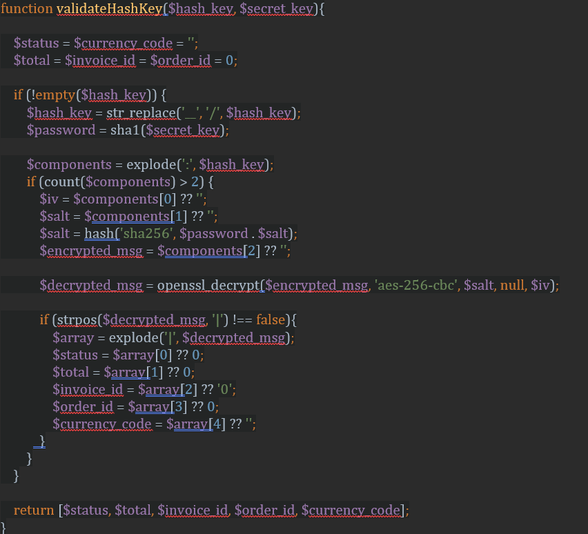

In 3d payment, after payment completion, it is redirected to merchant success or fail link. The problem with these links is that they can be accessed by an anonymous person. To prevent this problem, it is recommended to validate the request using hash key, since it is added some parameters to the links such as status, invoice_id, order_id and hash_key while redirection from Sipay.

Moreover, **in recurring payment**, for every recurrence, it is sent a post request to merchant webhook. As usually webhook is an open link. So, recurrence request can be validated using hash key as well. The validation process sample code is given below

Here, $hash_key must be taken from request and $secret_key is merchant app secret that was provided from Sipay.
Notes: $status = 0 or $status = 1 for 3d payment. But for recurring webhook, $status = COMPLETED or $status = FAILED
