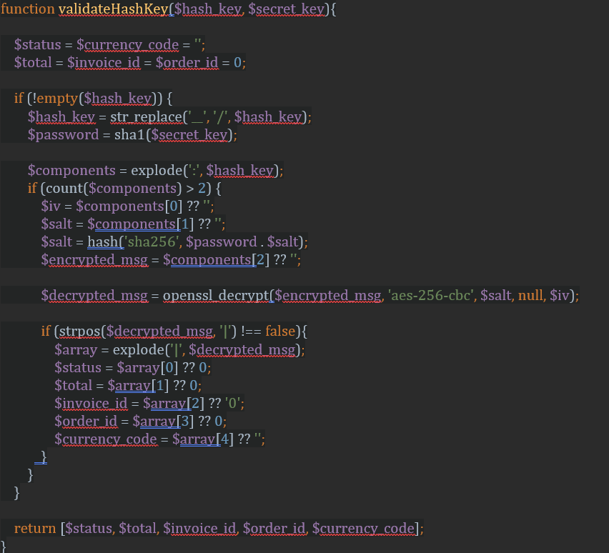

3D ödemede, ödeme tamamlandıktan sonra, kullanici üye işyerinin başarılı ya da  başarısız bağlantısına yönlendirilir. Bu bağlantılarla ilgili sorun, onlara anonim bir kişi tarafından erişilebilmesidir. Bu sorunu önlemek için, Sipay'den yönlendirme yapılırken status, invoice_id, order_id ve hash_key gibi bağlantılara bazı parametreler eklendiğinden ve isteğin, hash anahtarı kullanılarak doğrulanması önerilir.

Ayrıca, **yinelenen ödemede**, her yinelemede, üye işyeri webhook'una bir gönderi talebi gönderilir. Genellikle webhook açık bir bağlantıdır. Dolayısıyla, yineleme isteği, karma anahtar kullanılarak da doğrulanabilir. Doğrulama süreci örnek kodu aşağıda verilmiştir.

Burada, $hash_key istekten alınmalıdır ve $secret_key, Sipay'den sağlanan üye işyeri uygulamasının gizli anahtarıdır (app_secret).
Not: 3d ödeme için $status = 0  veya  $status= 1’dir. Fakat  yinelenen webhook için  $status = COMPLETED   veya $status = FAIL’dir.

